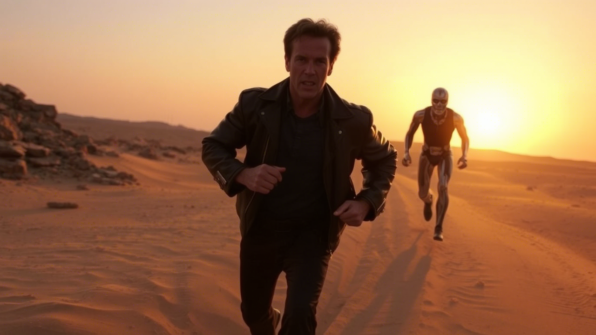

<h1 align="center":>Escape_from_desert</h1>

  
	
	

The final work for the second course on the professional module "Development of program modules" was defended for a grade of 5! 

<h3 align="center">Story about the idea of creating a game</h3>

At the end of the 2nd course it is necessary to present a console application in Java programming language.

The idea of the application was to make a console game on the principle of a wanderer with the search for a secret exit, which was generated randomly. 

After the realization of this idea came the idea of complicating the game by adding obstacles (walls and pits).

Then came the idea to add a terminator, which would make the game even more difficult. Terminator acts on the principle of randomly generated action. 

After that, the graphical design of the application was amended by using colored text in the console using ANSI codes.

<h3 align="center">Controls</h3>

Control was implemented by selecting actions by entering numbers in the application console.

<h1 align="center">Demonstration of the game</h1>

  

<h2 align="center"> Star History</h2>

<a href="https://star-history.com/#K1rsN7/Escape_from_the_desert&Date">
 <picture>
   <source media="(prefers-color-scheme: dark)" srcset="https://api.star-history.com/svg?repos=K1rsN7/Escape_from_the_desert&type=Date&theme=dark" />
   <source media="(prefers-color-scheme: light)" srcset="https://api.star-history.com/svg?repos=K1rsN7/Escape_from_the_desert&type=Date" />
   
 </picture>
</a>

